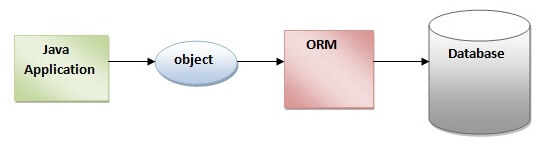
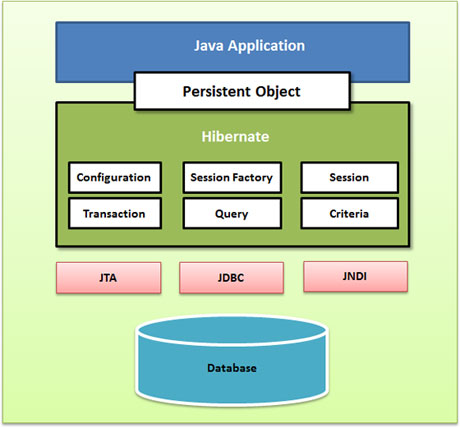

What is hibernate?

    
<b>Hibernate</b> is a Java framework that simplifies the development of Java application to interact with the database. 
        It is an open source, lightweight, ORM (Object Relational Mapping) tool. Hibernate implements the specifications 
        of JPA (Java Persistence API) for data persistence.
    

What is ORM?

    
ORM (Object Relational Mapping) is a programming strategy to map object with the data stored in the database. 
        It simplifies data creation, data manipulation, and data access 
        The ORM tool internally uses the JDBC API to interact with the database.
    

    

What is JPA?

    
Java Persistence API (JPA) is a Java specification that provides certain functionality and standard to ORM tools. 
        The javax.persistence package contains the JPA classes and interfaces
    

Advantages of Hibernate Framework

    <ol>
        <li><b>Open Source and Lightweight</b> - Hibernate framework is open source under the LGPL license and lightweight 
            <b>“lightweight”</b> means that doesn’t use many system resources due to its small memory footprint (RAM) and 
            low CPU usage
        </li>
        <li><b>Fast Performance</b> - The performance of hibernate framework is fast because cache is internally used in 
            hibernate framework. There are two types of cache in hibernate framework first level cache and second level cache. 
            First level cache is enabled by default
        </li>
        <li><b>Database Independent Query</b> - HQL (Hibernate Query Language) is the object-oriented version of SQL. 
            It generates the database independent queries. So you don't need to write database specific queries. 
            Before Hibernate, if database is changed for the project, we need to change the SQL query as well that leads 
            to the maintenance problem
        </li>
        <li><b>Automatic Table Creation</b> - Hibernate framework provides the facility to create the tables of the 
            database automatically. So there is no need to create tables in the database manually
        </li>
        <li><b>Simplifies Complex Join</b> - Fetching data from multiple tables is easy in hibernate framework</li>
        <li><b>Provides Query Statistics and Database Status</b> - Hibernate supports Query cache and provide statistics 
            about query and database status
        </li>
    </ol>

Why is Hibernate better than Java Database Connectivity (JDBC)?

    <ul>Hibernate outclasses JDBC because:
        <li>Hibernate code is cleaner and more readable thanks to the elimination of boiler-plate code, something found in JDBC</li>
        <li>HQL (Hibernate Query Language) is closer to Java and is more object-oriented</li>
        <li>Developers don’t need to write code to store and load data into the database</li>
        <li>Hibernate enables faster application development</li>
    </ul>

Hibernate supports:

    <ul>
        <li>DB2</li>
        <li>MySQL</li>
        <li>Oracle</li>
        <li>PostgreSQL</li>
        <li>SQL Server</li>
    </ul>

What is HQL?

    
HQL stands for Hibernate Query Language, a powerful object-oriented language independent of the database. 
        It’s like SQL, except that it uses objects instead of table names. HQL is a very simple, efficient, and flexible 
        query language used to do various operations on a relational database without the need for complex database queries
    

four ORM levels in Hibernate

    <ul>
        <li>Full Object Mapping</li>
        <li>Light Object Mapping</li>
        <li>Medium Object Mapping</li>
        <li>Pure Relational</li>
    </ul>

Show Hibernate overview?

    

Core interfaces are of hibernate framework?

    <ul>
        <li><b>Session Interface</b> - This is the primary interface used by hibernate applications. The instances of 
            this interface are lightweight and are inexpensive to create and destroy. Hibernate sessions are not thread safe
        </li>
        <li><b>SessionFactory Interface</b> - This is a factory that delivers the session objects to hibernate application. 
            Generally there will be a single SessionFactory for the whole application and it will be shared among all 
            the application threads
        </li>
        <li><b>Configuration Interface</b> - This interface is used to configure and bootstrap hibernate. The instance 
            of this interface is used by the application in order to specify the location of hibernate specific mapping 
            documents
        </li>
        <li><b>Transaction Interface</b> - This is an optional interface but the above three interfaces are mandatory in
            each and every application. This interface abstracts the code from any kind of transaction implementations 
            such as JDBC transaction, JTA transaction
        </li>
        <li><b>Query and Criteria Interface</b> - This interface allows the user to perform queries and also control the 
            flow of the query execution
        </li>
    </ul>

What is the difference between first-level cache and second-level cache?

    
<b>The first level cache</b> is associated with a Session and is used to store the currently loaded objects in memory  
        <b>The second level cache</b> is associated with a SessionFactory and is used to hold objects across multiple sessions, 
            thereby reducing the number of database queries needed
    

