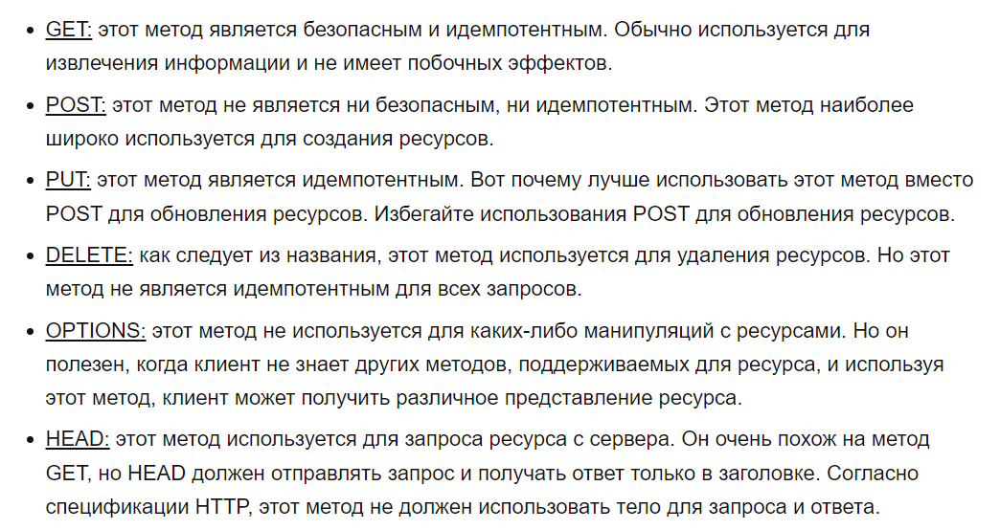
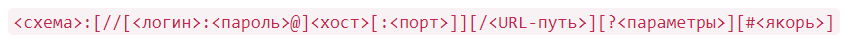

Что такое URI, URL, URN

    
<b>URI</b> - Uniform Resource Identifier (унифицированный идентификатор ресурса), обозначает имя и адрес ресурса в сети. Как правило, делится на URL и URN

    
<b>URL</b> - Uniform Resource Locator (унифицированный определитель местонахождения ресурса)-адрес некоторого ресурса в веб. 
        URL определяет местонахождение ресурса и способ обращения к нему
    

    
<b>URN</b> - Unifrorm Resource Name (унифицированное имя ресурса) - Имя некоторого ресурса в веб. Смысл URN в том,
        что он определяет только название конкретного предмета, который может находится во множестве конкретных мест
    
 
    

Протокол HTTP, как устроен, как работает, зачем нужен

    <a href="https://habr.com/ru/post/215117/">Простым языком об HTTP</a> 
    
<b>HTTP (HyperText Transfer Protocol(протокол передачи гипертекста))</b> - протокол передачи данных. 
        Этот протокол описывает взаимодействие между двумя компьютерами (клиентом и сервером), построенное на базе сообщений, 
        называемых запрос (Request) и ответ (Response) 
        Изначально — в виде гипертекстовых документов в формате HTML, в настоящее время используется для передачи произвольных данных
    

    
Протокол HTTP предполагает использование клиент-серверной структуры передачи данных. Клиентское приложение формирует 
        запрос и отправляет его на сервер, после чего серверное программное обеспечение обрабатывает данный запрос, 
        формирует ответ и передаёт его обратно клиенту
    

    <ol>HTTP запросы и ответы имеют близкую структуру. Они состоят из:
        <li>Стартовой строки, описывающей запрос, или статус (успех или сбой). Это всегда одна строка</li>
        <li>Произвольного набора HTTP заголовков, определяющих запрос или описывающих тело сообщения</li>
        <li>Пустой строки, указывающей, что вся мета информация отправлена</li>
        <li>Произвольного тела, содержащего пересылаемые с запросом данные (например, содержимое HTML-формы ) или 
            отправляемый в ответ документ. Наличие тела и его размер определяется стартовой строкой и заголовками HTTP
        </li>
    </ol>
    
Стартовую строку вместе с заголовками сообщения HTTP называют головой запроса, а его данные - телом

    <h3>Запросы</h3>
    <h4>Стартовая строка</h4>
    <ol>HTTP запросы - это сообщения, отправляемые клиентом, чтобы инициировать реакцию со стороны сервера. Их стартовая 
        строка состоит из трёх элементов:
        <li><b>Метод HTTP</b> - глагол (например, GET, PUT или POST) или существительное (например, HEAD или OPTIONS), 
            описывающие требуемое действие. Например, GET указывает, что нужно доставить некоторый ресурс, а POST означает 
            отправку данных на сервер (для создания или модификации ресурса, или генерации возвращаемого документа)
        </li>
        <li><b>Цель запроса</b> - обычно URL, или абсолютный путь протокола, порт и домен обычно характеризуются контекстом 
            запроса. Формат цели запроса зависит от используемого HTTP-метода. Это может быть
            <ul>
                <li>Абсолютный путь, за которым следует '?' и строка запроса. Это самая распространённая форма, называемая 
                    исходной формой (origin form) . Используется с методами GET, POST, HEAD, и OPTIONS. POST / HTTP 1.1 
                    GET /background.png HTTP/1.0 HEAD /test.html?query=alibaba HTTP/1.1 OPTIONS /anypage.html HTTP/1.0
                </li>
                <li>Полный URL - абсолютная форма (absolute form) , обычно используется с GET при подключении к прокси. 
                    GET http://developer.mozilla.org/ru/docs/Web/HTTP/Messages HTTP/1.1
                </li>
                <li>Компонента URL "authority", состоящая из имени домена и (необязательно) порта (предваряемого символом ':'),
                    называется authority form. Используется только с методом CONNECT при установке туннеля HTTP. 
                    CONNECT developer.mozilla.org:80 HTTP/1.1
                </li>
                <li>Форма звёздочки (asterisk form), просто "звёздочка" ('*') используется с методом OPTIONS и представляет сервер. 
                    OPTIONS * HTTP/1.1
                </li>
            </ul>
        </li>
        <li><b>Версия HTTP</b> - определяющая структуру оставшегося сообщения, указывая, какую версию предполагается использовать для ответа</li>
    </ol>
    <h4>Заголовки</h4>
    
Заголовки запроса HTTP имеют стандартную для заголовка HTTP структуру: не зависящая от регистра строка, завершаемая 
        (':') и значение, структура которого определяется заголовком. Весь заголовок, включая значение, представляет собой
        одну строку, которая может быть довольно длинной
    

    <ul>Существует множество заголовков запроса. Их можно разделить на несколько групп:
        <li>Основные заголовки (General headers), например, Via (en-US), относящиеся к сообщению в целом</li>
        <li>Заголовки запроса (Request headers), например, User-Agent, Accept-Type, уточняющие запрос (как, например, 
            Accept-Language), придающие контекст (как Referer), или накладывающие ограничения на условия (like If-None)
        </li>
        <li>Заголовки сущности, например Content-Length, относящиеся к телу сообщения. Как легко понять, они отсутствуют, 
            если у запроса нет тела
        </li>
    </ul>
    <h4>Тело</h4>
    
Бывает не у всех запросов: запросы, собирающие (fetching) ресурсы, такие как GET, HEAD, DELETE, или OPTIONS, 
        в нем обычно не нуждаются. Но некоторые запросы отправляют на сервер данные для обновления, как это часто бывает 
        с запросами POST (содержащими данные HTML-форм)
    

    <ul>Тела можно грубо разделить на две категории
        <li>Одноресурсные тела (Single-resource bodies), состоящие из одного отдельного файла, определяемого двумя заголовками: 
            Content-Type и Content-Length
        </li>
        <li>Многоресурсные тела (Multiple-resource bodies), состоящие из множества частей, каждая из которых содержит 
            свой бит информации. Они обычно связаны с HTML-формами
        </li>
    </ul>
    <h3>Ответы</h3>
    <h4>Строка статуса (Status line)</h4>
    <ol>Стартовая строка ответа HTTP, называемая строкой статуса, содержит следующую информацию:
        <li>Версию протокола, обычно HTTP/1.1</li>
        <li>Код состояния (status code), показывающая, был ли запрос успешным. Примеры: 200, 404 или 302</li>
        <li>Пояснение (status text). Краткое текстовое описание кода состояния, помогающее пользователю понять сообщение HTTP</li>
    </ol>
    
Пример 
        HTTP/1.1 404 Not Found
    

    <h4>Заголовки</h4>
    
Заголовки ответов HTTP имеют ту же структуру, что и все остальные заголовки: не зависящая от регистра строка, 
        завершаемая двоеточием (':') и значение, структура которого определяется типом заголовка. Весь заголовок, c
        включая значение, представляет собой одну строку
    

    <h4>Тело</h4>
    
Оно есть не у всех ответов: у ответов с кодом состояния, например, 201 или 204, оно обычно отсутствует

    <ol>Тела можно разделить на три категории:
        <li>Одноресурсные тела (Single-resource bodies), состоящие из отдельного файла известной длины, определяемые двумя заголовками:
            Content-Type и Content-Length
        </li>
        <li>Одноресурсные тела (Single-resource bodies), состоящие из отдельного файла неизвестной длины, 
            разбитого на небольшие части (chunks) с заголовком Transfer-Encoding (en-US), значением которого является chunked
        </li>
        <li>Многоресурсные тела (Multiple-resource bodies), состоящие из многокомпонентного тела, каждая часть которого 
            содержит свой сегмент информации. Они относительно редки
        </li>
    </ol>
     
    <ul>Аспекты HTTP
        <li><b>простота</b> - HTTP-сообщения могут читаться и пониматься людьми, обеспечивая более лёгкое тестирование разработчиков и уменьшенную сложность для новых пользователей</li>
        <li><b>расширяемость</b> - Введённые в HTTP/1.0 HTTP-заголовки сделали этот протокол лёгким для расширения и экспериментирования. 
            Новая функциональность может быть даже введена простым соглашением между клиентом и сервером о семантике нового заголовка
        </li>
        <li><b>не имеет состояния, но имеет сессию</b> - не существует связи между двумя запросами, которые последовательно 
            выполняются по одному соединению. Из этого немедленно следует возможность проблем для пользователя, пытающегося 
            взаимодействовать с определённой страницей последовательно, например, при использовании корзины в электронном магазине. 
            Но хотя ядро HTTP не имеет состояния, куки позволяют использовать сессии с сохранением состояния. Используя расширяемость 
            заголовков, куки добавляются к рабочему потоку, позволяя сессии на каждом HTTP-запросе делиться некоторым контекстом или состоянием
        </li>
    </ul>

Методы протокола

    
<b>Метод HTTP (англ. HTTP Method)</b> - последовательность из любых символов, кроме управляющих и разделителей, 
        указывающая на основную операцию над ресурсом. Обычно метод представляет собой короткое английское слово, 
        записанное заглавными буквами (Табл. 1). Названия метода чувствительны к регистру
    

    <ol>Все HTTP Methods можно разделить на три большие группы
        <li><b>Безопасные</b> — не меняют данные, можно выполнять их в любой последовательности. К ним относятся GET, HEAD и OPTIONS</li>
        <li><b>Идемпотентные </b> — когда вы получаете один и тот же ответ, сколько раз вы вызываете один и тот же ресурс,
            он известен как идемпотентный. Например, когда вы пытаетесь обновить одни и те же данные на сервере,
            ответ будет таким же для каждого запроса, сделанного с одинаковыми данными. 
            GET, HEAD, PUT, DELETE, OPTIONS, TRACE
        </li>
        <li><b>Неидемпотентные</b> — при повторном выполнении результаты будут отличаться. POST и PATCH</li>
    </ol>
     
    <h4>GET</h4>
    
Используется для запроса содержимого указанного ресурса. С помощью метода GET можно также начать какой-либо процесс. 
        В этом случае в тело ответного сообщения следует включить информацию о ходе выполнения процесса. Клиент может 
        передавать параметры выполнения запроса в URI целевого ресурса после символа «?»: GET /path/resource?param1=value1¶m2=value2 HTTP/1.1
    

    
Согласно стандарту HTTP, запросы типа GET считаются идемпотентными[4] — многократное повторение одного и того же 
        запроса GET должно приводить к одинаковым результатам (при условии, что сам ресурс не изменился за время между запросами). 
        Это позволяет кэшировать ответы на запросы GET
    

    <h4>HEAD</h4>
    
Аналогичен методу GET, за исключением того, что в ответе сервера отсутствует тело. Запрос HEAD обычно применяется 
        для извлечения метаданных, проверки наличия ресурса (валидация URL) и чтобы узнать, не изменился ли он с момента последнего обращения. 
        Заголовки ответа могут кэшироваться. При несовпадении метаданных ресурса с соответствующей информацией в кэше копия ресурса помечается как устаревшая
    

    <h4>POST</h4>
    
Применяется для передачи пользовательских данных заданному ресурсу. Например, в блогах посетители обычно могут вводить свои комментарии к записям в HTML-форму, 
        после чего они передаются серверу методом POST, и он помещает их на страницу. При этом передаваемые данные (в примере с блогами — текст комментария) включаются 
        в тело запроса. Аналогично с помощью метода POST обычно загружаются файлы
    

    
В отличие от метода GET, метод POST не считается идемпотентным[4], то есть многократное повторение одних и тех же 
        запросов POST может возвращать разные результаты (например, после каждой отправки комментария будет появляться одна 
        копия этого комментария)
    

    
При результатах выполнения 200 (Ok) и 204 (No Content) в тело ответа следует включить сообщение об итоге выполнения запроса.
        Если был создан ресурс, то серверу следует вернуть ответ 201 (Created) с указанием URI нового ресурса в заголовке Location
    

    <h4>PUT</h4>
    
Предназначен для создания новой или полного обновления существующей сущности. Может работать только с одой сущностью.
    

    <h4>PATCH</h4>
    
Предназначен для частичного обновления существующей сущности

    <h4>DELETE</h4>
    
Удаляет указанный ресурс

    <h4>TRACE</h4>
    
Возвращает полученный запрос так, что клиент может увидеть, какую информацию промежуточные серверы добавляют или изменяют в запросе

    <h4>CONNECT</h4>
    
Преобразует соединение запроса в прозрачный TCP/IP-туннель, обычно, чтобы содействовать установлению защищённого SSL-соединения через нешифрованный прокси

    <h4>OPTIONS</h4>
    
Используется для определения возможностей веб-сервера или параметров соединения для конкретного ресурса. В ответ 
        серверу следует включить заголовок Allow со списком поддерживаемых методов. Также в заголовке ответа может включаться информация о поддерживаемых расширениях
    

Rest что такое, как устроено, что такое RESTfull и зачем нам нужен

    
<b>REST (Representational State Transfer)</b> - архитектурный стиль взаимодействия компонентов распределённого приложения в сети.
        Другими словами, REST — это набор правил того, как программисту организовать написание кода серверного приложения,
        чтобы все системы легко обменивались данными и приложение можно было масштабировать
    

    <h4>Принцип работы</h4>
    
REST API основывается на протоколе передачи гипертекста HTTP (Hypertext Transfer Protocol). Это стандартный протокол в интернете, 
        созданный для передачи гипертекста. Сейчас с помощью HTTP отправляют любые другие типы данных
    

    <ul>Преимущества REST
        <li>Производительность</li>
        <li>Масштабируемость</li>
        <li>Гибкость к изменениям</li>
        <li>Отказоустойчивость</li>
        <li>Простота поддержки</li>
    </ul>
    <ul>В REST API есть 4 метода HTTP, которые используют для действий с объектами на серверах:
        <li>GET (получение информации о данных или списка объектов)</li>
        <li>DELETE (удаление данных)</li>
        <li>POST (добавление или замена данных)</li>
        <li>PUT (регулярное обновление данных)</li>
    </ul>
    
Такие запросы еще называют идентификаторами CRUD: create (создать), read (прочесть), update (обновить) delete (удалить)

Принципы REST

    <h4>Клиент-серверная архитектура</h4>
    
заключается в разделении некоторых зон ответственности: в разделении функций клиента и сервера

    
Например, мы разделяем нашу систему так, что клиент (допустим, это мобильное приложение) реализует только функциональное взаимодействие с сервером. 
        При этом сервер реализует в себе логику хранения данных, сложные взаимодействия со смежными системами и т.д.
    

    <h4>Отсутствие записи состояния клиента (Stateless)</h4>
    
Сервер не должен хранить какой-либо информации о клиентах. В запросе должна храниться вся необходимая информация 
        для обработки запроса и если необходимо, идентификации клиента
    

    <h4>Кэшируемость (Casheable)</h4>
    
В данных запроса должно быть указано, нужно ли кэшировать данные (сохранять в специальном буфере для частых запросов).
        Если такое указание есть, клиент получит право обращаться к этому буферу при необходимости 
        Это нужно и полезно, если у сервера часто запрашивают одинаковую информацию
    

    <h4>Единство интерфейса (Uniform Interface)</h4>
    
Единый интерфейс определяет интерфейс между клиентами и серверами. Это упрощает и отделяет архитектуру, которая 
        позволяет каждой части развиваться самостоятельно
    

    <ol>
        <li><b>Identification of resources (основан на ресурсах)</b> - В REST ресурсом является все то, чему можно дать имя. 
            Например,пользователь, изображение, предмет (майка, голодная собака, текущая погода) и т.д. Каждый ресурс в REST 
            должен быть идентифицирован посредством стабильного идентификатора, который не меняется при изменении состояния 
            ресурса. Идентификатором в REST является URI
        </li>
        <li><b>Manipulation of resources through representations. (Манипуляции над ресурсами через представления)</b> - 
            Представление в REST используется для выполнения действий над ресурсами. Представление ресурса представляет
            собой текущее или желаемое состояние ресурса. Например, если ресурсом является пользователь, то представлением 
            может являться XML или HTML описание этого пользователя.
        </li>
        <li><b>Self-descriptive messages (само-документируемые сообщения)</b> - Под само-описательностью имеется ввиду, 
            что запрос и ответ должны хранить в себе всю необходимую информацию для их обработки. Не должны быть дополнительные
            сообщения или кэши для обработки одного запроса. Другими словами отсутствие состояния, сохраняемого между запросами 
            к ресурсам. Это очень важно для масштабирования системы
        </li>
        <li><b>HATEOAS (hypermedia as the engine of application state)</b> - Статус ресурса передается через содержимое body, 
            параметры строки запроса, заголовки запросов и запрашиваемый URI (имя ресурса). Это называется гипермедиа 
            (или гиперссылки с гипертекстом). HATEOAS также означает, что, в случае необходимости ссылки могут содержатся
            в теле ответа (или заголовках) для поддержки URI, извлечения самого объекта или запрошенных объектов
        </li>
    </ol>
    <h4>Многоуровневость системы (Layered System)</h4>
    
Концепция многоуровневой архитектуры заключается в том, что ни клиент, ни сервер не должны знать о том, как 
        происходит цепочка вызовов дальше своих прямых соседей 
        В реальной жизни между ними могут быть, к примеру, proxy-сервера, роутеры, балансировщики и тд. 
        И то, по какому пути запрос проходит от клиента до сервера, мы часто не можем знать.
    

    <h4>Предоставление кода по запросу (Code on Demand)</h4>
    
Серверы могут отправлять клиенту код (например, скрипт для запуска видео). Так общий код приложения или сайта 
        становится сложнее только при необходимости
    

    <h4>Начало от нуля (Starting with the Null Style)</h4>
    
Клиент знает только одну точку входа на сервер. Дальнейшие возможности по взаимодействию обеспечиваются сервером

Request Payload

    
<b>Request Payload</b> - это любые данные, отправленные в теле запроса

Что такое SOAP, почему его сравнивают с REST, в чем разница

    
<b>SOAP (Simple Object Access Protocol)</b> - это протокол, по которому веб-сервисы взаимодействуют друг с другом 
        или с клиентами. SOAP API — это веб-сервис, использующий протокол SOAP для обмена сообщениями между серверами и 
        клиентами. При этом сообщения должны быть написаны на языке XML в соответствии со строгими стандартами, 
        иначе сервер вернет ошибку
    

    <h4>Особенности</h4>
    <ul>Корректное SOAP-сообщение состоит из нескольких структурных элементов: 
        
        <li><b>Envelope («конверт»)</b> - Это корневой элемент. Определяет XML-документ как сообщение SOAP с помощью 
            пространства имен xmlns:soap=»http://www.w3.org/2003/05/soap-envelope/». Если в определении будет указан 
            другой адрес, сервер вернет ошибку
        </li>
        <li><b>Header («заголовок»)</b> - Включает в себя атрибуты сообщения, связанные с конкретным приложением (аутентификация, 
            проведение платежей и т.д.). В заголовке могут использоваться три атрибута, которые указывают, как принимающая 
            сторона должна обрабатывать сообщение, — mustUnderstand, actor и encodingStyle. 
            Значение mustUnderstand — 1 или 0 — говорит принимающему приложению о том, следует ли распознавать заголовок в обязательном или опциональном порядке 
            Атрибут actor задает конкретную конечную точку для сообщения 
            Атрибут encodingStyle устанавливает специфическую кодировку для элемента. 
            По умолчанию SOAP-сообщение не имеет определенной кодировки
        </li>
        <li><b>Body («тело»)</b> - Сообщение, которое передает веб-приложение. Может содержать запрос к серверу или ответ от него</li>
        <li><b>Fault («ошибка»)</b> - Опциональный элемент. Передает уведомление об ошибках, если они возникли в ходе обработки сообщения.
            Может содержать вложенные элементы, которые проясняют причину возникновения ошибки:
            <ul>
                <li><b>faultcode</b> - код неполадки</li>
                <li><b>faultstring</b> - описание проблемы</li>
                <li><b>faultactor</b> - информация о программном компоненте, который вызвал ошибку</li>
                <li><b>detail</b> - дополнительные сведения о месте возникновения неполадки</li>
            </ul>
        </li>
    </ul>
    <h4>Отличия SOAP И REST</h4>
    
SOAP — протокол, а REST — архитектурный стиль, набор правил по написанию кода. REST был представлен в 2000 году. 
        К этому времени недостатки SOAP были очевидны: 
        объемные сообщения 
        поддержка только одного формата — XML 
        схема работы по принципу «один запрос — один ответ» 
        смена описания веб-сервиса может нарушить работу клиента 
    

    
REST поддерживает несколько форматов помимо XML: JSON, TXT, CSV, HTML. Вместо создания громоздкой структуры 
        XML-запросов при использовании REST чаще всего можно передать нужный URL. Эти особенности делают стиль REST 
        простым и понятным, а приложения и веб-сервисы, использующие его, отличаются высокой производительностью и легко 
        масштабируются
    

    <ul>Недостатки REST
        <li>при использовании REST сложнее обеспечить безопасность конфиденциальных данных</li>
        <li>трудности с проведением операций, которым необходимо сохранение состояния. Как, например, в случае с корзиной
            в онлайн-магазине, которая должна сохранять добавленные товары до момента оплаты
        </li>
    </ul>
    <ul>В каких случаях используют SOAP
        <li>Асинхронная обработка и последующий вызов. Стандарт SOAP 1.2 обеспечивает клиенту гарантированный уровень надежности и безопасности</li>
        <li>Формальное средство коммуникации. Если клиент и сервер имеют соглашение о формате обмена, то SOAP 1.2 
            предоставляет жесткие спецификации для такого типа взаимодействия. Пример — сайт онлайн-покупок, на котором 
            пользователи добавляют товары в корзину перед оплатой. Предположим, что есть веб-служба, которая выполняет 
            окончательный платеж. Может быть достигнуто соглашение, что веб-сервис будет принимать только название товара, 
            цену за единицу и количество. Если сценарий существует, лучше использовать протокол SOAP
        </li>
        <li>Операции с состоянием. Если приложение требует, чтобы состояние сохранялось от одного запроса к другому, 
            то стандарт SOAP 1.2 предоставляет структуру для поддержки таких требований
        </li>
    </ul>

Структура rest url

    
URL (англ. Uniform Resource Locator) - единообразный определитель местонахождения ресурса

     
     
    <ul>
        <li><b>схема</b> - схема обращения к ресурсу; в большинстве случаев имеется в виду сетевой протокол</li>
        <li><b>логин</b> - имя пользователя, используемое для доступа к ресурсу</li>
        <li><b>пароль</b> - пароль указанного пользователя</li>
        <li><b>хост</b> - полностью прописанное доменное имя хоста в системе DNS или IP-адрес</li>
        <li><b>порт</b> - порт хоста для подключения. Для http схемы используется по-умолчанию 80</li>
        <li><b>URL-путь</b> - уточняющая информация о месте нахождения ресурса; зависит от протокола</li>
        <li><b>параметры</b> - строка запроса с передаваемыми на сервер (методом GET) параметрами. Начинается с символа ?, 
            разделитель параметров — знак &. Пример: ?параметр_1=значение_1&параметр_2=значение_2&параметр3=значение_3
        </li>
        <li><b>якорь</b> - идентификатор «якоря» с предшествующим символом #. Якорем может быть указан заголовок внутри 
            документа или атрибут id элемента. По такой ссылке браузер откроет страницу и переместит окно к указанному элементу
        </li>
    </ul>

Логическая разница между XML и JSON

    <a href="https://coderlessons.com/tutorials/veb-razrabotka/arkhitektura-veb-servisov/10-json-protiv-xml">JSON против XML</a> 
    <a href="https://webref.ru/dev/json-tutorial/json-vs-xml">JSON и XML</a> 
    
JSON - это формат обмена данными, его цель — облегчить обмен структурированными данными. Это достигается путём непосредственного 
        представления объектов, массивов, чисел, строк и логических значений, которые часто присутствуют в исходном 
        окружении и в месте назначения
    

    
XML - является языком разметки, его цель — разметка документа

    <ul>КЛЮЧЕВАЯ РАЗНИЦА:
        <li>Объект JSON имеет тип, тогда как данные XML не содержат типов</li>
        <li>JSON не имеет возможностей отображения, тогда как XML предлагает возможность отображения данных</li>
        <li>JSON менее защищен, тогда как XML более безопасен по сравнению с JSON</li>
        <li>JSON поддерживает только кодировку UTF-8, тогда как XML поддерживает различные форматы кодирования</li>
    </ul>

Что помогает нам проверять, проектировать REST (приложения, фреймв)

    <ul>
        <li><b>TestNG</b> - тестирование REST API</li>
        <li><b>Postman</b> - приложение для мануального тестирования и проверки REST API</li>
        <li><b>Boomerang</b> - аналог Postman виде плагина для браузера</li>
        <li><b>Swagger</b> - для документирования REST</li>
    </ul>

HEAD (придумать пример)

    
Метод HEAD идентичен GET, за исключением того, что сервер не возвращает содержимое HTTP-ответа

    
Когда вы отправляете запрос HEAD, это означает, что вас интересуют только код ответа и HTTP headers, а не сам документ

    
Например, если у вас много ссылок на веб-сайте, вы можете периодически отправлять HEAD-запросы каждой из них, 
        чтобы проверить наличие неработающих ссылок. Это будет намного быстрее, чем при использовании GET
    

Коды статуса HTTP

    <ul>
        <li>200 используются для успешных запросов</li>
        <li>300 для перенаправления</li>
        <li>400 используются, если возникла проблема с запросом</li>
        <li>500 используются, если возникла проблема с сервером</li>
    </ul>
    <h4>300</h4>
    
<b>302 (or 307) Moved Temporarily & 301 Moved Permanently</b>

    
302 и 301 обрабатываются браузером очень похоже, но они могут иметь различные значения для spiders поисковых систем. 
        Например, если ваш сайт не готов для обслуживания, вы можете перенаправить его в другое место с помощью 302. 
        Поисковая система продолжит проверку вашей страницы в будущем. Но если вы перенаправите с использованием 301, 
        это сообщит spider, что ваш сайт переехал в это место навсегда. За более точной информацией: 
        http://www.nettuts.com перейдите на https://net.tutsplus.com/ используя 301 код вместо 302
    

Заголовки HTTP в запросах HTTP

    <h4>Host</h4>
    
HTTP-запрос отправляется на определенные IP-адреса. Но так как большинство серверов способны размещать несколько сайтов под одним IP, 
        они должны знать, какое доменное имя ищет браузер: 
        Host: net.tutsplus.com
    

    <h4>User-Agent</h4>
    
Этот заголовок может содержать несколько частей информации, таких как: имя и версия браузера; название и версия операционной системы;
        язык по умолчанию 
        Именно так веб-сайты могут собирать определённую общую информацию о своих
    

    <h4>Accept-Language</h4>
    
Этот заголовок отображает настройки языка по умолчанию. Если сайт имеет разные языковые версии, он может перенаправить 
        нового пользователя на основе этих данных 
        Accept-Language: en-us,en;q=0.5
    

