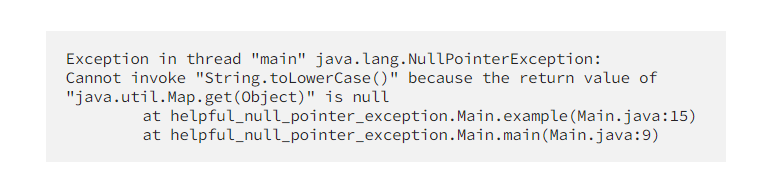

Switch-выражения

    
<b>Switch-выражения</b> — это оператор switch с улучшенным синтаксисом и функциональностью

    
можно определять более одного условия для одного и тот же случая

    
не нужно использовать ключевое слово break, чтобы остановить выполнение. При использовании switch-выражений 
        выполняется только правая часть соответствующего случая, если применяется синтаксис со стрелкой (->)
    

    
поскольку операторы switch стали switch-выражениями, а выражения вычисляют значение, то теперь они могут 
        возвращать значение
    

    
выражения switch являются исчерпывающими. Если вы забудете указать случай в выражении switch, то получите ошибку 
        во время компиляции. Если вы охватываете все случаи, вам не нужно иметь случай “по умолчанию”
    

    
Возможность выполнения блок кода

Текстовые блоки

    

Сопоставление с образцом (Pattern Matching) для instanceof

   

Полезные NullPointerException

    

Записи (Record)

    
Тип record создает неизменяемый класс с приватными финализированными полями, геттерами, методом toString, а также 
        методами equals и hashCode
    

    

Запечатанные классы (sealed)

    
При помощи этой функции класс может указывать, какие классы могут его расширять

    

toList() в стримах

    
Было:

    
    
Стало:

    

