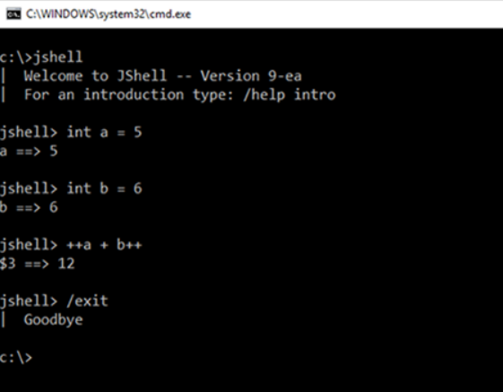

<h2>Java 9. What's new?</h2>

JShell (REPL — read-eval-print loop)

    
Это реализация в Java интерактивной консоли, которая используется для тестирования функционала и использования в 
        консоли разных конструкций, например интерфейсов, классов, enum,  операторов и т.д.
    

    
Для запуска JShell нужно лишь написать в терминале — jshell.

    
С помощью JShell можно создавать методы верхнего уровня и использовать их внутри той же сессии. 
        Методы будут работать, как и статические методы, за исключением того, что ключевое слово static можно упустить
    
 
     
    <a href="https://proselyte.net/tutorials/java9/repl-jshell/">Руководство по Java 9. REPL (JShell)</a>

Private в интерфейсах

    
Появилась возможность использовать private методы в интерфейсах (default и static методы, так как другие мы попросту 
        не можем переопределить из-за недостаточного доступа) 
        private static void someMethod(){}
    

    

        Приватные методы могут быть либо не статическими, либо статическими, так же они обязаны иметь реализацию
    
 
    <a href="https://vertex-academy.com/tutorials/ru/java-9-privatnye-metody-v-interfejsah/">Java 9 Приватные методы в 
        интерфейсе
    </a>

Модульность (Jigsaw)

    
<b>Модуль</b> — это группа взаимосвязанных пакетов и ресурсов вместе с новым файлом дескриптора модуля. 
        Данный подход используется, чтобы ослабить связанность кода. Ослабление связи — ключевой фактор для удобства 
        поддержки и расширяемости кода
    
 
    <a href="https://proselyte.net/tutorials/java9/modularity/">Руководство по Java 9. Модульность</a>

Immutable Collection (List, Set, Map, и Map.Entry)

    
Стало возможным создание и заполнение коллекции одной строкой, при этом делая её immutable (ранее для создания 
        immutable коллекции нам нужно было создать коллекцию, заполнить её данными, и вызов метода, например — 
        Collections.unmodifiableList)
    

    
<b>List someList = List.of("first","second","third");</b>

Optional

    
<b>Stream из Optional</b> - Если Optional будет пустым, то и Stream, соответственно. 
        Нам нужно найти в базе всех персонажей по именам и вывести на экран их фамилии с помощью Java 8. нам приходится 
        проверять  Optinal перед тем как взять его значение. Но в Java 9 это можно сделать проще, ведь мы можем сделать 
        Stream из Optional
    

    
<b>Optional.ifPresentOrElse()</b> -  позволяет выполнить одно действие, если значение в Optional присутствует, и
        другое  - если его нет. Т.е., если значение Optional присутствует, исполняется наше действие, если нет - 
        запускается переданный Runnable.
    

    
<b>Optional.or()</b>

ProcessHandle

    
Были добавлены еновые классы и методы для более удобного управления действиями операционной системы

    
ProcessHandle currentProcess = ProcessHandle.current(); 
        System.out.println("Current Process Id: " + currentProcess.getPid());
    

G1 — дефолтный сборщик мусора

    
Parallel / Throughput Collector считался дефолтным в прошлых версиях, но теперь его заменил G1, который был 
        представлен в Java 7 и был разработан для лучшей поддержки куч размером более 4GB. Он вызывает меньше GC пауз
    

Реактивное программирование. Java SE 9 Reactive Streams API

    
<b>Реактивное программирование</b> — программирование с асинхронными потоками данных. Обычные события клика — 
        это тоже асинхронные потоки данных, которые вы можете прослушивать, чтобы реагировать какими-либо действиями
    

    
<b>Java SE 9 Reactive Streams API</b> — фреймворк для реализации асинхронных, масштабируемых и параллельных приложений с использованием Java.

    

