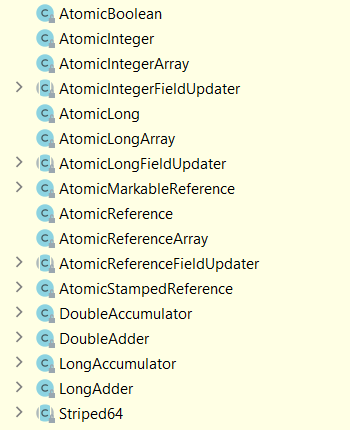

Основные понятия локов?

    
<b>Lock API</b> - конкурент <b>synchronized</b>. Присутствует с 5ой версии Java, с появлением Concurrency API.

    
<b>Lock</b> - это базовый интерфейс Lock API. Он обеспечивает функциональность ключевого слова synchronized,
        добавляя новые методы для удобной работы
    

    <h4>Java docs:</h4>
    
<b>Lock</b> - это инструмент для управления доступом к общему ресурсу несколькими потоками. 

    
Реализации Lock обеспечивают более обширные операции блокировки, чем можно получить с помощью synchronized
        методов и операторов. Они допускают более гибкое структурирование, могут иметь совершенно разные свойства и 
        могут поддерживать несколько связанных объектов условий (Condition)
    

    
<b>ReentrantLock</b> - самая часто используемая реализация Lock.

Основные методы предоставляемые интерфейсом Lock?

    <ul>
        <li><b>void	lock()</b> - приобретает блокировки. Если lock недоступен, текущий поток бездействует до тех пор,
            пока lock не будет получен
        </li>
        <li><b>void	unlock()</b> - снятие блокировки. Реализация блокировки обычно накладывает ограничения на то, какой
            поток может снять блокировку (обычно только владелец блокировки может ее снять) и может генерировать (unchecked)
            исключение, если ограничение нарушается. Любые ограничения и тип исключения должны быть задокументированы 
            этой реализацией блокировки
        </li>
        <li><b>boolean tryLock()</b> - Пытается запросить блокировку. Этот метод не входит в состояние ожидания, если
            блокировка недоступна. Вместо этого он возвращает логическое значение true, если блокировка получена,
            или логическое значение false, если в данный момент блокировка используется другим потоком исполнения
        </li>
        <li><b>void	lockInterruptibly()</b> - ожидает до тех пор, пока не будет получена вызываемая блокировка, если 
            только не будет прервано ожидание
        </li>
        <li><b>boolean tryLock(long time, TimeUnit unit)</b> -пытается получить блокировку. Если блокировка недоступна,
            этот метод будет ожидать в течение периода времени time. Время ожидания указывается в единицах, обозначаемых
            параметром unit. Если блокировка получена, то возвращается логическое значение true. А если блокировка не
            была получена в течение заданного периода времени, то возвращается false
        </li>
        <li><b>Condition newCondition()</b> - возвращает объект типа Condition, связанный с вызываемой блокировкой</li>
    </ul>

Lock Conditions

    <a href="https://metanit.com/java/tutorial/8.10.php">Условия в блокировках</a>
    
<b>Condition</b> - интерфейс из пакета java.util.concurrent.locks, использование объектов которого, позволяет
        добиться контроля над управлением доступом к потокам
    

    
Применение объектов Condition во многом аналогично использованию методов wait/notify/notifyAll класса Object

    <ul>методы:
        <li><b>await</b> - поток ожидает, пока не будет выполнено некоторое условие и пока другой поток не вызовет методы 
            signal/signalAll. Во многом аналогичен методу wait класса Object
        </li>
        <li><b>signal</b> - сигнализирует, что поток, у которого ранее был вызван метод await(), может продолжить работу.
            Применение аналогично использованию методу notify класса Object
        </li>
        <li><b>signalAll</b> - сигнализирует всем потокам, у которых ранее был вызван метод await(), что они могут продолжить работу.
            Аналогичен методу notifyAll() класса Object
        </li>
    </ul>

Причины ввода locks? Главные отличия locks и synchronized?

    <ul>Различия synchronized и Lock
        <li>Lock это интерфейс Lock API, synchronized - ключевое слово, использующееся для описания метода или блока</li>
        <li>synchronized снимает блокировку автоматически, а Lock должен снимать блокировку "вручную"</li>
        <li>Lock может прервать ответ потока, ожидающего блокировки, а Synchronized — нет, и поток будет ждать все время</li>
        <li>Lock позволяет узнать, есть ли у потока блокировка, а Synchronized — нет.</li>
        <li>Lock может повысить эффективность работы нескольких потоков</li>
        <li>Synchronized блокирует на классах, и объектах. Lock на любой части</li>
    </ul>

Атомики, предпосылки для их использования? (Описание работы операции инкриментации в java)

    
<b>Atomic</b> – семейство классов из java.util.concurrent. Они предоставляют набор атомарных операций для соответствующих типов

    
Атомарные операции — операции, выполняющиеся как единое целое либо не выполняющиеся вовсе. Т. е. это операция, во 
        время исполнения которой данные, читаемые/изменяемые этой операцией не могут быть изменены другой операцией
    

    
Атомарная операция - это операция в общей области памяти, которая завершается в 1 шаг, относительно других потоков,
        имеющих доступ к этой памяти. 
        Во время выполнения такой операции над переменной, ни один поток не может наблюдать изменение наполовину завершенным
    

    
операция инкремента в Java (i++) - не является атомарной, а выполняется за несколько шагов. И если несколько потоков
        будут выполнять операцию инкрементации над одной и той же переменной, нет гарантий что на выходе значение переменной
        будет ожидаемым
    

Решение проблемы неатомарных действий? (критические секции / локи / volitile)

    <ul>для решения проблем неатомарных действий, можно использовать
        <li>критические секции - synchronized блоки, дают гарантию, что в данный момент времени, только 1 поток может 
            находится в критической секции (synchronized блоке, методе). Но: блокировка и снятие блокировок вызовут больше 
            задержек переключения контекста и планирования, что приведет к снижению производительности
        </li>
        <li>locks - один из способов синхроницации, явные блокировки</li>
        <li>volatile - ключевое слово, использующееся при объявлении переменных, гарантирующее, что любой поток, работающий
            с этой переменной будет иметь актуальное значение
        </li>
    </ul>

Принцип работы atomics? (CAS)

    <a href="https://coderlessons.com/articles/java/kak-rabotaet-cas-sravnenie-i-zamena-v-java">Как работает CAS (сравнение и замена) в Java</a> 
    
Есть несколько типов команд, с помощью которых можно добиться атомарности: load-link and store-conditional (LL/SC), compare-and-swap (CAS) и другие

    <ul>как работает CAS:
        <li>Сравнение значения примитива со значением, которое мы получили</li>
        <li>Если значения не совпадают, это означает, что какой-то поток между ними изменил значение. Иначе он пойдет дальше и поменяет значение на новое</li>
    </ul>
    
Операция CAS состоит из трех операндов: ячейки памяти (V), ожидаемого исходного значения (A) и нового значения (B).
        Если значение ячейки памяти соответствует ожидаемому исходному значению, процессор автоматически обновит значение
        ячейки до нового значения. В противном случае процессор ничего не делает. В любом случае он вернет значение этой 
        позиции перед инструкцией CAS. (CAS думает: «Я думаю, что позиция V должна содержать значение A, если она содержит
        это значение, поместите B в эту позицию, в противном случае не меняйте позицию, просто сообщите мне текущее 
        значение этой позиции».)
    

    
Методы категории compare-and-set принимают старое значение и новое. Если переданное старое значение совпало с
        текущим, устанавливается новое. Обычно делегируют вызов в методы класса Unsafe, которые заменяются нативными
        реализациями виртуальной машины. Виртуальная машина в большинстве случаев использует атомарную операцию процессора
        compare-and-swap (CAS). Поэтому атомики обычно более эффективны чем стандартная дорогостоящая блокировка
    

Классы пакета java.util.concurrent.atomics

    <a href="https://java-online.ru/concurrent-atomic.xhtml">Атомарные классы пакета util.concurrent</a> 
    
<b>AtomicBoolean, AtomicInteger, AtomicLong, AtomicReference</b> - Atomic-классы для boolean, integer, long и ссылок на объекты 
        Классы этой группы содержат метод compareAndSet, принимающий 2 аргумента : предполагаемое текущее и новое значения.
        Метод устанавливает объекту новое значение, если текущее равно предполагаемому, и возвращает true. Если текущее
        значение изменилось, то метод вернет false и новое значение не будет установлено 
        Кроме этого, классы имеют метод getAndSet, который безусловно устанавливает новое значение и возвращает старое. 
        Классы AtomicInteger и AtomicLong имеют также методы инкремента/декремента/добавления нового значения.
    

<b>AtomicIntegerArray, AtomicLongArray, AtomicReferenceArray</b> - Atomic-классы для массивов integer, long и ссылок на объекты. 
        Элементы массивов могут быть изменены атомарно.
    

    

Основные методы предоставляемые классом Atomics

    <ul>
        <li><b>boolean compareAndSet(expectedValue, updateValue)</b> - атомарно устанавливает переменную updateValue,
            если она в настоящее время содержит ожидаемое значение, возвращая true в случае успеха
        </li>
        <li><b>int getAndIncrement()</b> - инкрементирует и возвращает предыдущее</li>
        <li><b>int incrementAndGet()</b> - инкрементирует и возвращает текущее</li>
        <li><b>int getAndDecrement()</b> - декрементирует и возвращает предыдущее</li>
        <li><b>int decrementAndGet()</b> - декрементирует и возвращает текущее</li>
    </ul>

