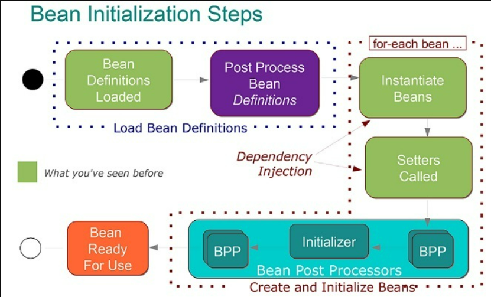

<h3><a href="https://www.baeldung.com/spring-interview-questions#spring-core">Spring Core</a>:</h3>

What Is Spring Framework?

    
<b>Spring</b> is an open-source application framework for Java, providing comprehensive infrastructure support 
        for developing Java applications. It offers a wide range of features and functionalities for building 
        enterprise-level applications and simplifying the development process
    

Benefits of Using Spring

    <ul>
        <li><b>Lightweight</b> - there is a slight overhead of using the framework in development</li>
        <li><b>IoC container</b> - is a core component of the Spring Framework that manages the lifecycle of Java objects, 
            also known as beans. It implements the principle of inversion of control, where the control over the 
            instantiation and management of objects is transferred from the application to the container
        </li>
        <li><b>Inversion of Control (IoC)</b> - Spring container takes care of wiring dependencies of various objects 
            instead of creating or looking for dependent objects
        </li>
        <li><b>Aspect-Oriented Programming (AOP)</b> - supports AOP to separate business logic from system services</li>
        <li><b>Exception Handling</b> - Spring provides a convenient API for translating technology-specific exceptions 
            into unchecked exceptions
        </li>
    </ul>

IoC Container

    
<b></b> - is a core component of the Spring Framework that manages the lifecycle of Java objects, also known as beans. 
        It implements the principle of inversion of control, where the control over the instantiation and management of 
        objects is transferred from the application to the container.
    

    <ul>Key features:
        <li><b>Bean Management</b> - creates, initializes, configures, and assembles Java objects (beans) based on the 
            configuration metadata provided, such as XML configuration files, Java annotations, or Java code
        </li> 
        <li><b>Dependency Injection (DI)</b> - The IoC container performs dependency injection, where it injects the 
            required dependencies into the beans during runtime, eliminating the need for manual object creation and wiring
        </li> 
        <li><b>Lifecycle Management</b> - The IoC container manages the lifecycle of beans, including instantiation, 
            initialization, and destruction. It ensures that the beans are created and destroyed appropriately, based 
            on the configuration settings
        </li> 
        <li><b>Loose Coupling and Configuration Flexibility</b> - the IoC container promotes loose coupling between 
            components and provides flexibility in configuring the application components
        </li> 
        <li><b>Aspect-Oriented Programming (AOP) Integration</b> - The IoC container integrates seamlessly with the AOP 
            module of the Spring Framework, enabling the implementation of cross-cutting concerns, such as logging, security, 
            and transactions, without affecting the core business logic
        </li> 
    </ul>

Projects Of Spring

    <ul>
        <li><b>Core</b> - a key module that provides fundamental parts of the framework, such as IoC or DI</li>
        <li><b>JDBC</b> - enables a JDBC-abstraction layer that removes the need to do JDBC coding for specific vendor 
            databases
        </li>
        <li><b>Web</b> - a web-oriented integration module that provides multipart file upload, Servlet listeners and 
            web-oriented application context functionalities
        </li>
        <li><b>Data</b> - provides a consistent approach to data access by offering a set of abstractions and APIs for 
            working with various data sources and databases
        </li>
        <li><b>MVC</b> - provides a powerful model-view-controller (MVC) architecture for building web applications, 
            facilitating the development of robust and flexible web solutions
        </li>
        <li><b>Boot</b> - simplifies the development of production-ready applications, providing an opinionated view
            and set of defaults for building stand-alone, production-grade Spring-based applications
        </li>
    </ul>

Dependency Injection (DI)

    
Is an aspect of Inversion of Control (IoC), is a general concept stating that we do not create our objects manually 
        but instead describe how they should be created. Then an IoC container will instantiate required classes if needed
    

    <a href="https://www.baeldung.com/inversion-control-and-dependency-injection-in-spring">More details</a>

How Can We Inject Beans in Spring?

    <ul>
        <li><b>Setter</b> - when dealing with optional dependencies or when there is a need to update the dependency after the bean has been instantiated</li>
        <li><b>Constructor</b> - creates of immutable objects and helps to ensure that the class is always in a valid state</li>
        <li><b>Field</b> - more suitable for simpler scenarios where there is no additional logic required during the injection process</li>
    </ul>

ApplicationContext

    
is the central interface for providing configuration information to the Spring container. It represents the Spring 
        IoC container and is responsible for managing the lifecycle of Spring beans within an application. The ApplicationContext 
        is the mechanism through which you can access and manage the beans and their dependencies defined in the Spring configuration 
        files
    

BeanFactory

    

        the BeanFactory interface is the core container for managing bean instances. It serves as the foundation for 
        implementing the Inversion of Control (IoC) and Dependency Injection (DI) features of the Spring Framework. The 
        BeanFactory interface provides the fundamental methods for retrieving beans from the container and managing their 
        lifecycle
    

What Is a Spring Bean

    
The Spring Beans are Java Objects that are initialized by the Spring IoC container

Default Bean Scope in Spring Framework

    
<b>singleton</b>

Scopes  in Spring

    <ul>
        <li><b>Singleton</b> - 
            

                The default scope in Spring, where a single bean instance is created for each Spring IoC container. 
                This single instance is shared by all requests for that bean, ensuring that all requests receive the 
                same instance
            

        </li>
        <li><b>Prototype</b> - 
            

                With the prototype scope, a new bean instance is created every time the bean is requested from the Spring 
                container. This scope is useful for beans that maintain a non-singleton state or have expensive 
                initialization processes
            

        </li>
        <li><b>Request</b> - 
            

                This scope is specific to web applications and creates a new instance of the bean for each HTTP request. 
                The bean instance is bound to the lifecycle of a single HTTP request, making it available only within 
                that request.
                If we try to use object of class annotated by this scope, we will receive exception: 
                "java.lang.IllegalStateException: No thread-bound request found: Are you referring to request attributes outside of an actual web request"
            

        </li>
        <li><b>Session</b> - 
            

                Also specific to web applications, the session scope creates a single bean instance for each HTTP session. 
                The bean instance is available throughout the entire duration of the user session, making it accessible 
                across multiple HTTP requests
            

        </li>
        <li><b>Global Session</b> - 
            

                Similar to the session scope, the global session scope is specific to portlet-based web applications and 
                creates a single bean instance for each global HTTP session. The bean instance is accessible across 
                multiple portlets within the same global session
            

        </li>
        <li><b>Application</b> - 
            

                This scope creates a single bean instance for the entire web application context. The bean instance is
                created when the application context is initialized and is destroyed when the application context is 
                destroyed
            

        </li>
        <li><b>Custom Scopes</b> - 
            

                Spring also allows you to define custom scopes tailored to specific application requirements. Custom 
                scopes enable you to control the lifecycle and visibility of beans based on custom-defined rules and 
                contexts.
            

        </li>
        <li><b>WebSocket (since Spring 4.0)</b> - 
            

                The WebSocket scope is introduced to handle the lifecycle of beans within the context of WebSocket sessions. 
                In this scope, a new instance of the bean is created for each WebSocket session, which allows you to store 
                user-specific data for WebSocket sessions.
            

        </li>
    </ul>

Spring Bean Life Cycle

     
    <ol>
        <li><b>Bean definition</b> - The bean's configuration and metadata are defined, either via XML, Java annotations, 
            or Java-based configuration
        </li>
        <li><b>Instantiation</b> - Spring creates an instance of the bean based on the bean definition</li>
        <li><b>Dependency injection</b> - Spring resolves and injects the dependencies (required beans and configurations) 
            declared in the bean definition, using either setter injection, constructor injection, or field injection
        </li>
        <li><b>Bean post-processing</b> - Spring allows you to modify bean instances or their properties after the bean
            has been instantiated and configured, but before it is used by other components. Any beans implementing 
            BeanPostProcessor will have their postProcessBeforeInitialization and postProcessAfterInitialization 
            methods called
        </li>
        <li><b>Initialization</b> - Spring executes any custom initialization code defined by the bean, such as invoking 
            the bean's @PostConstruct method, the afterPropertiesSet method from the InitializingBean interface, or a 
            custom init method specified in the bean definition
        </li>
        <li><b>Ready for use</b> - At this stage, the bean is fully constructed, initialized, and ready for use within 
            the application. It participates in the normal operation of the application, fulfilling its intended purpose
        </li>
        <li><b>Bean termination</b> - When the application context is closed or shut down, the bean's life cycle comes 
            to an end. Spring allows you to execute custom destruction code, such as invoking the bean's @PreDestroy method, 
            the destroy method from the DisposableBean interface, or a custom destroy method specified in the bean definition
        </li>
    </ol>

